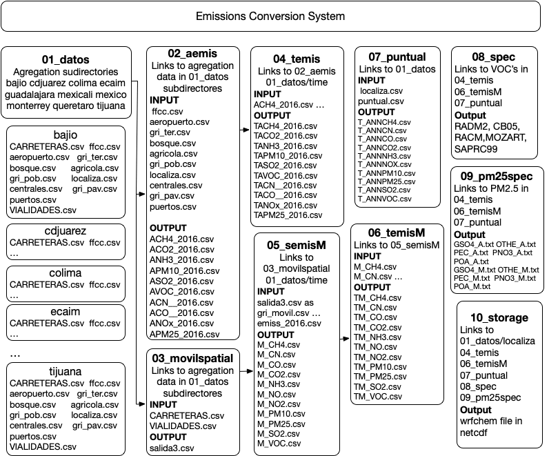

10-mar-2021

# Emissions conversion system

National Emissions inventory is converted for air quality modeling from municipalities to a regular grid.

It can process all the country or a preselected area from:

|9 km grid| 3 km grid| 1 km grid|Description|
|---      |---       |---     |---|
| mexico9 | mexico   | | All the country|
|         | jalisco  |guadalajara| State and city|
|         |monterrey3|monterrey|Saltillo-MTY, MTY|
|         |ecaim3    | ecaim | Central Mexico |
|         | bajio3   | bajio | Guanajuato State|
|   |queretaro |  |Queretaro State|
|   | |cdjuarez | Juarez City, Chi|
|   | |tijuana |Tijuana City, BC|
|   | |mexicali | Mexicali City, BC|
|   | |colima | Colima state |

## Directories description

- `01_datos` Information for each area containing the grid, surrogates for area emissions
a subdirectory `time` with temporal distribution files.
- `02_aemis` process area municipality emissions into the grid. Spatial distribution.
- `03_movilspatial` Streets and highway distribution in the grid.
- `04_temis` Area emissions temporal distribution.
- `05_semisM` Mobile emission spatial distribution. (considers local temporal profiles for CDMX)
- `06_temisM` Mobile emissions temporal distribution.
- `07_puntual` point source temporal distribution.
- `08_spec` Chemical speciation distribution.
- `09_pm25spec` PM2.5 speciation (BC, SO4, NO3, Other)
- `10_storage` read outputs from 04, 06, 07 ,08 and 09 and generates a netcdf file
- `12_cmaq` CBMV mechanism for CMAQ model
- `inventario` output subdirectory

---
## Sistema de conversión de emisiones

[1.](#desc)  **Descripción del proceso de conversión de emisiones**

 [A.](#dir-datos) **Directorio  01\_datos**

[B.](#area) **Directorio  02\_emis**

[C.](#mobile) **Directorio 03\_movilspatial**

[D.](#areatime) **Directorio 04\_temis**

[E.](#mobilegrid) **Directorio 05\_semisM**

[F.](#mobiltime) **Directorio 06\_temisM**

[G.](#fijas) **Directorio 07\_puntual**

[H.](#especies) **Directorio 08\_spec**

[I.](#pm25) **Directorio 09\_pm25spec**

[J.](#guarda) **Directorio 10\_storage**

[2.](#script) **Proceso de ejecución**

[Annex 1.](#anexo1) **Tamaño de salidas**

---
###  Descripción del proceso de conversión de emisiones

La conversión de inventario de emisiones a un inventario útil para modelación se realiza en diferentes pasos que se muestran en la ilustración 1 cada uno de estos pasos es un subdirectorio dentro del directorio principal.

_Figura 1 Esquema general de la conversión de emisiones para modelación de calidad del aire_

### Directorio  01\_datos

En este directorio se encuentra los subdirectorios de cada una de las áreas del inventario, y de datos de empleados para la distribución temporal. Las áreas que considera son las siguientes:

1. bajio – área correspondiente al estado de Guanajuato 1x1 km
2. bajio3 – área correspondiente al estado de Guanajuato 3x3 km
3. cdjuarez – la ciudad fronteriza de Chihuahua 1x1 km
4. colima – es todo el estado de Colima 1x1 km
5. ecaim – Centro de México . 1x1 km
6. ecaim3 - Centro de México 3x3 km
7. guadalajara – Zona Metropolitana de Guadalajara 1x1 km
8. jalisco -    Estado de Jalisco 3x3 km
9. mexicali – Ciudad fronteriza de BC 1x1 km
10. mexico – Toda la república mexicana 3x3 km
11. mexico9 – Toda la república mexicana 9x9 km 
12. monterrey - Zona metropolitana de Monterrey 1x1 km
13. monterrey3 - Zona metropolitana de Monterrey y Saltillo  3x3 km
14. queretaro - estado de Queretaro a 3x3 km
15. tijuana – Zona metropolitana de Tijuana 1x1 km

Cada uno de estos subdirectorios contiene los archivos para la distribución espacial de las emisiones en la malla que considera el área de estudio correspondiente, los archivos que contiene se describen a continuación:

- aeropuerto.csv - celdas que abarca el (los) aeropuerto(s)
- agricola.csv – celdas con fracción de área agrícola.
- bosque.csv – celdas con fracción de vegetación no agrícola.[^1]
- CARRETERAS.csv – celdas con fracción de superficie de carreteras.
- centrales.csv – celdas que abarcan la centrales camioneras.
- ffc.csv – celdas correspondientes a la superficie de estaciones y patios de ferrocarril.
- gri\_pav.csv – celdas correspondientes a la superfice de vialidades pavimentadas.
- gri\_pob.csv – celdas con fracción de población urbana, rural y total.
- gri\_ter.csv – celdas con fracciones de superficie de vialidades de terracería.
- localiza.csv – contiene la localización en lon, lat, utm y la población para cada celda del área de estudio.
- puertos.csv - celdas correspondientes a la superficie de puertos marítimos.
- VIALIDADES.csv – celdas con fracción de superficie de vialidades en ciudades.

La fracción en cada celda es relativa al municipio de donde se encuentra, así si en la celda se tienen 100 m^2 de área agrícola y en el municipio hay 1000 m^2 en la fracción correspondiente a la celda se tendría un valor de 0.1 (100/1000).

En el caso de población el se tiene que para cada celda se tiene tres categorías: población urbana, rural y la suma de ambas. La proporción es con base a la población del municipio para cada categoría.

Cada archivo posee las siguientes columnas:

1. GRIDCODE – El identificador de la celda dentro del dominio
2. CVENTMUN – El identificador de municipio, los dos primeros dígitos es el estado y los tres sigueintes el número de municipio
3. Fa – La fracción de área correspondiente a la categoria que representa el archivo.

En el directorio time contiene los siguientes archivos:

  1. anio2016.csv – contiene la fecha y el tipo de día (lun a dom) para cada día del año 2016
  2. temporal\_01.txt- contiene el código SCC y su correspondiente perfil anual, semanal y horario.
  3. temporal\_mon.txt – contiene el perfil anual y la proporcion de emisiones mensuales.
  4. temporal\_week.txt – contiene el perfil semanal y la propocion para cada día de la semana.
  5. temporal\_wkday.txt – contiene el perfil diario y la proporcion horaria de Lun a vie
  6. temporal\_wkend.txt - contiene el perfil diario y proporcion horaria de sab y dom.

Cada archivo posee un encabezado la primera columna corresponde al SCC (para el caso de temporal\_01.txt) y los valores en las siguientes columnas muestran el identificador del perfil anual, semanal y diario. En el temporal\_mon.txt se tiene el identificador anual y luego 13 valores enteros, que representan los valores de emisión mensuales y el último es la suma de lo 12 anteriores, para obtener la fracción de emisión de enero se divide el entero de la segunda columna sobre el valor de la columna 13. En el caso de temporal\_week.txt se tiene en el identificador semanal en la primer columna y ocho columnas con números enteros donde el numero de la segunda columna es del lunes y el último es la suma de los siete anteriores. La fracción temporal del lunes se obtiene de dividir el valor de la segunda columna con el último. El archivo temporal\_wkday.txt la primera columna es el identificador del perfil diario y las 25 columnas siguientes son el valor horario siendo la última la suma de las 24 anteriores. Para obtener la fracción de tiempo de la primera hora se divide el valor de la segunda columna sobre el valor de la columna 26.

La información de este directorio es utilizada para el proceso de distribución espacial y temporal.

### Directorio 02\_emis 

En este directorio se realiza la distribución espacial de las emisiones, contiene el programa para la distribución espacial y los archivos que contienen el inventario de emisiones de fuentes de área distribuido por contaminante, que son:

- IBC\_\_2016.csv – emisiones de carbono negro
- ICO\_\_2016.csv – emisiones de monóxido de carbono
- ICO2\_2016.csv – emisiones de dióxido de carbono
- imet\_2016.csv – emisiones de metano.
- INH3\_2016.csv - emisiones de amoníaco
- INOx\_2016.csv - enisimines de óxidos de nitrógeno
- IPM10\_2016.csv - emisiones de partículas PM10
- IPM25\_2016.csv – emisiones de particulas PM2.5
- ISO2\_2016.csv – emisiones de dióxido de azufre.
- IVOC\_2016.csv – emisiones de Compuestos Orgánicos Volátiles

Cada uno de estos archivos contiene por reglón el identificador de municipio CVENTMUN y el código de clasificación de emisiones SCC en cada columna. Asi se tienen 2459 reglones correspondientes a cada municipio del país.

Una vez que se ha realizado el proceso de distribución espacial se generan los archivos con las emisiones distribuidas en la región, que son los siguientes

    ACH4_2016.csv ACO__2016.csv ANH3_2016.csv APM10_2016.csv ASO2_2016.csv
    ACN__2016.csv ACO2_2016.csv ANOx_2016.csv APM25_2016.csv AVOC_2016.csv

### Directorio 03\_movilspatial

En este directorio se agrupan las fracciones de superficie de área de carreteras y de vialidades en un solo archivos (salida3.csv) que se empela para la distribución de emisiones vehiculares.

### Directorio 04\_temis

En este directorio se realiza la distribución temporal de las emisiones de fuentes de área, mediante el programa en fortran Atemporal.exe que emplea los archivos generados en 02\_aemis y los que contienen los perfiles temporales, los archivos de salida que genera son: TACH4\_2016.csv TACO\_\_2016.csv TANH3\_2016.csv TAPM102016.csv TASO2\_2016.csv TACN\_\_2016.csv TACO2\_2016.csv TANOx\_2016.csv TAPM2\_2016.csv y TAVOC\_2016.csv

Correspondientes a cada contaminante y para el caso de PM2.5 y VOC se incluye una columna con el código SCC que se emplea para la especiación química.

### Directorio 05\_semisM

En este directorio se realiza la distribución espacial de las emisiones de fuentes móviles, emplea el archivo de distribución de vialdiades (salida3.csv) de 03\_movilspatial y el de emisiones emiss\_2016.csv donde la primer columna es el identificador de municipio CVENMUN, la segunda el código de emisión SCC y las subsecuentes son los compuestos emitidos: VOC, CO, NO, NO2, NH3, PM10, PM2.5, CN, CO2, SO2 y CH4. Una vez ejecutado el programa MSpatial.exe se obtienen los archivos con la distribución espacial de las emisiones: M\_CH4.csv, M\_CN.csv, M\_CO2.csv, M\_CO.csv, M\_NH3.csv, M\_NO2.csv, M\_NO.csv, M\_PM10.csv, M\_PM25.csv, M\_SO2.csv, M\_VOC.csv.

### Directorio 06\_temisM

Aquí se realiza la distribución temporal de las emisiones de fuentes móviles mediante el programa `Mtemporal.exe`, que emplea como entrada los archivos del directorio `05\_semisM` y los archvios que contienen los perfiles temporales (`01\_datos/time`), los archivos de salida que genera son: `TMCH4\_2016.csv, TMCO\_\_2016.csv, TMCOV\_2016.csv, TMNO\_\_2016.csv, TMPM102016.csv, TMSO2\_2016.csv, TMCN\_\_2016.csv, TMCO2\_2016.csv, TMNH3\_2016.csv, TMNO2\_2016.csv` y `TMPM2\_2016.csv.`

Correspondientes a cada contaminante y para el caso de PM2.5 y COV se incluye una columna con el código SCC que se emplea para la especiación química.

### Directorio 07\_puntual

En este directorio se realiza la distribución temporal de las emisiones de fuentes fijas mediante el programa `Puntual.exe`, emplea el archivo de emisiones `Puntual2016.csv` y los archvios que contienen los perfiles temporales (`01\_datos/time`), los archivos de salida que genera son: `T\_ANNCH4.csv, T\_ANNCO2.csv, T\_ANNNH3.csv, T\_ANNPM10.csv, T\_ANNSO2.csv, T\_ANNCN.csv, T\_ANNCO.csv, T\_ANNNOX.csv, T\_ANNPM25.csv` y` T\_ANNVOC.csv`.

Correspondientes a cada contaminante y para el caso de PM2.5 y VOC se incluye una columna con el código SCC que se emplea para la especiación química.

### Directorio 08\_spec

En este directorio se realiza la especiación química de los VOC para luego agruparlos en el mecanismo químico solicitado. Emplea como entradas los archivos de emisiones de VOC de los directorios `04\_temis, 06\_temisM y 07\_puntual`. Los perfiles de especiacion con base al código SCC del archivo `scc-profiles.txt` y el del mecanismo químico que puede ser alguno de los siguientes:

- profile\_cbm05.csv – Mecanimso químico Carbon Bond V
- profile\_mozart.csv – Mecanismo MOZART (Model for OZone And Related chemical Tracers
- profile\_racm2.csv – Mecanismo Regional Atmospheric Chemistry Mechanism (RACM)
- profile\_saprc99.csv -Mecanismo Statewide Air Pollution Research Center (SAPRC)
- profile\_radm2.csv – Mecanismo Regional Acid Deposition Model, ver 2. (RADM2)

Para la realización de esto se emplean tres programas, uno para cada tipo de fuente así:

- `spa.exe` es para emisiones de área
- `spm.exe` para emisiones de fuentes móviles
- `spp.exe` para emisiones de fuentes fijas

Las salidas de este programa inician con el correspondiente nombre del mecanismo en mayúsculas seguido de un guión y la abreviatura de la categoría de emisión, seguido de un guión bajo para terminar con el tipo de fuente A – área, M- móvil y P- puntual. Todos son archivos de texto (.txt)

Un ejemplo del mecanismo **RADM2** seria para fuentes de área:

    RADM-2_ALD_A.txt RADM-2_GLY_A.txt RADM-2_HCHO_A.txt RADM-2_MGLY_A.txt
    RADM-2_OLT_A.txt RADM-2_XYL_A.txt RADM-2_CH4_A.txt  RADM-2_HC3_A.txt
    RADM-2_ISO_A.txt RADM-2_MVK_A.txt RADM-2_ORA1_A.txt RADM-2_CSL_A.txt
    RADM-2_HC5_A.txt RADM-2_KET_A.txt RADM-2_OL2_A.txt  RADM-2_ORA2_A.txt
    RADM-2_ETH_A.txt RADM-2_HC8_A.txt RADM-2_MACR_A.txt RADM-2_OLI_A.txt
    RADM-2_TOL_A.txt

Fuentes móviles:

    RADM-2_ALD_M.txt RADM-2_GLY_M.txt RADM-2_HCHO_M.txt RADM-2_MGLY_M.txt
    RADM-2_OLT_M.txt RADM-2_XYL_M.txt RADM-2_CH4_M.txt  RADM-2_HC3_M.txt
    RADM-2_ISO_M.txt RADM-2_MVK_M.txt RADM-2_ORA1_M.txt RADM-2_CSL_M.txt
    RADM-2_HC5_M.txt RADM-2_KET_M.txt RADM-2_OL2_M.txt  RADM-2_ORA2_M.txt
    RADM-2_ETH_M.txt RADM-2_HC8_M.txt RADM-2_MACR_M.txt RADM-2_OLI_M.txt
    RADM-2_TOL_M.txt

Fuentes puntuales:

    RADM-2_ALD_P.txt RADM-2_GLY_P.txt RADM-2_HCHO_P.txt RADM-2_MGLY_P.txt
    RADM-2_OLT_P.txt RADM-2_XYL_P.txt RADM-2_CH4_P.txt  RADM-2_HC3_P.txt
    RADM-2_ISO_P.txt RADM-2_MVK_P.txt RADM-2_ORA1_P.txt RADM-2_CSL_P.txt
    RADM-2_HC5_P.txt RADM-2_KET_P.txt RADM-2_OL2_P.txt  RADM-2_ORA2_P.txt
    RADM-2_ETH_P.txt RADM-2_HC8_P.txt RADM-2_MACR_P.txt RADM-2_OLI_P.txt
    RADM-2_TOL_P.txt

### Directorio 09\_pm25spec

En este directorio se realiza la especiación de PM2.5 emplea los archivos de emisiones de PM2.5 generados despues de la distribución espacial y localizados en los directorios 04\_temis, 06\_temisM y 07\_puntual. Los perfiles de especiacion con base al código SCC del archivo scc-profile\_pm25.csv y del especiación pm25\_profiles.csv. Se emplean tres programas, uno para cada tipo de fuente asi:

- spm25a.exe es para emisiones de área
- spm25m.exe para emisiones de fuentes móviles
- spm25p.exe para emisiones de fuentes fijas

Las salidas de este programa inician con la abreviatura correspondiente a la categoria de partícula:

- POA – Otros aerosoles orgánicos
- PEC - Carbono elemental
- GSO4 - Particulas sulfato
- PNO3 - Partículas nitrato
- OTHER - otras partículas

Se obtienen los siguientes archivos de salida para fuentes de área:

`GSO4_A.txt OTHE_A.txt PEC_A.txt PNO3_A.txt POA_A.txt`

Fuentes móviles

`GSO4_M.txt OTHE_M.txt PEC_M.txt PNO3_M.txt POA_M.txt`

Y fuentes fijas:

`GSO4_P.txt OTHE_P.txt PEC_P.txt PNO3_P.txt POA_P.txt`

### Directorio 10\_storage

En este se crea el archivo de salida en formato netcdf con las emisiones generadas en los directorios `04_temis`, 06_temisM , `07_puntual`, `08_spec` y `09_pm25spec`. Se ejecuta el programa `emiss.exe` que tiene como salida el archivo correspondiente al área y mecanismos seleccionados así tenemos como ejemplos para Cd Juárez y Mexicali con el mecanismo RADM2 y para abril 30 del 2016:

      wrfchemi_d01_radm2_cdjuarez_2016-04-30_00:00:00
      wrfchemi_d01_radm2_mexicali_2016-04-30_00:00:00

---

## Proceso de ejecución

En el directorio principal emis\_2016 se edita el script emis\_2016.sh

  1. Selección del área a la variable dominio se le asigna el nombre del área de interés

         # Selecciona area de modelacion
         # bajio bajio3 cdjuarez   colima    ecacor  ecaim ecaim3
         # guadalajara  jalisco    mexicali  mexico  mexico9
         # monterrey    monterrey3 queretaro tijuana
         #
         dominio= **ecaim**

  2. Se indica si se desea calcular la distribución espacial.  `HacerArea=0` si es la __primera vez__ que se corre el área . y `HacerArea=0`  misma área diferente fecha.

         HacerArea=1

  3. Se selecciona el mecanismo, asignado el valor en MECHA en el caso de __saprc99__  se puede asignar  la variable  `model = 0` para  WRF  y  ` =1` para CHIMERE

          # Los mecanismos a usar cbm04 cbm05 mozart racm2 radm2 saprc99
          #
          MECHA=radm2
          model =0
  4. Se selecciona el mes asignado el valor en la variable mes

          # Cambiar aqui la fecha
          mes=5
          dia=9
          dia2=9
          
Se selecciona el día inicial  __dia__ y final __dia2__. Se selecciona el año en la variable __nyear__.
  
          # Aqui cambiar el año a modelar
          #
          nyear=2016
          #
  5. Se selecciona si se quiere un archivo o dos archivos por día en la variable: `nfile`

          # Si se desea un archivo de 24 hrs nfile=1
          # dos archivos de 12 hrs nfile=2
          nfile=2

  1. Si para el periodo es durante el horario de verano y no se desea que se realice el cambio de horario se cambia la variable `lsummer` de `.true.` a `.false.` en las **dos** partes donde aparece. Línea 91 y 159.
  2. Se ejecuta el script bash emis\_2016.sh

## Tamaño de salidas

La siguiente tabla muestra el tamaño de las salidas para cada área considerando sólo un día del año.

| **Área** | **Tamaño** |
| --- |  --:|
| Bajío | 1.6 GB |
| Cd Juárez | 51 MB |
| Colima | 333 MB |
| Centro de México (Ecaim) | 2.4 GB |
| Guadalajara | 59 MB |
| Mexicali | 141 MB |
| Monterrey | 176 MB |
| México | 22 GB |
| Tijuana | 42 MB |

[1]: La superficie de _bosque_ representa **todo** tipo de vegetación en la celda que no es agrícola.

### CHIMERE
El sistema puede generar las salidas en el formato para el modelo [CHIMERE] [2]  cambios son:
1. los nombres de las variables 
2. las unidades en molecules s-1 cm-2
3. El nombre del archivo de salida inicia con:  __AEMISSIONS.saprc...__

[2]: https://www.lmd.polytechnique.fr/chimere/2020_getcode.php  
