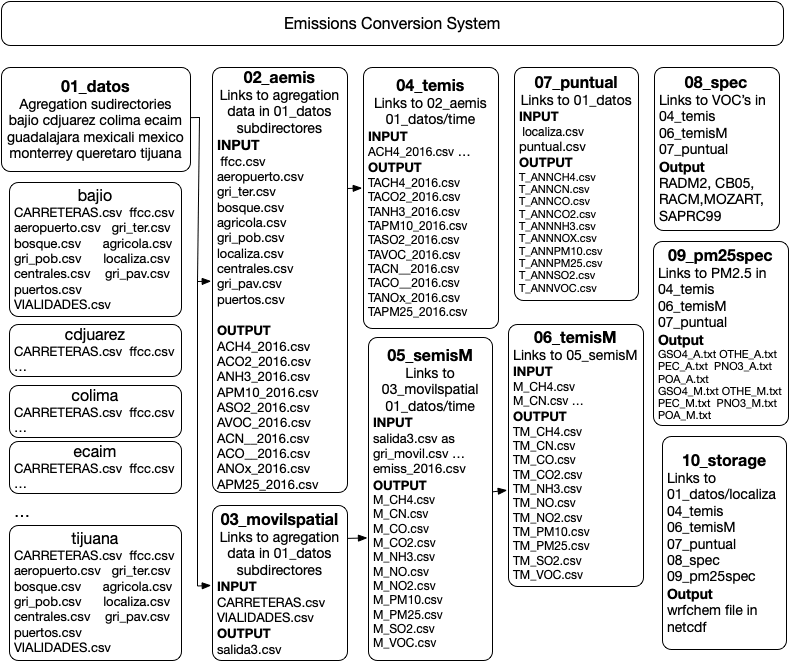

# emis_2016 — Sistema de Conversión del Inventario Nacional de Emisiones 2016

[](https://www.gnu.org/licenses/gpl-3.0)
[]()
[](https://github.com/JoseAgustin/emis_2016/releases/tag/v3.5)

> Convierte el Inventario Nacional de Emisiones (INE) 2016 de contaminantes criterio a una estructura y formato adecuados para modelización de calidad del aire con WRF-Chem y CHIMERE.

---

## Tabla de contenidos

- [Descripción general](#descripción-general)
- [Requisitos](#requisitos)
- [Instalación](#instalación)
- [Áreas de modelación soportadas](#áreas-de-modelación-soportadas)
- [Estructura del repositorio](#estructura-del-repositorio)
  - [Directorio `01_datos`](#directorio-01_datos)
  - [Directorio `Sources`](#directorio-sources)
  - [Directorio `12_cmaq`](#directorio-12_cmaq)
- [Archivos de entrada](#archivos-de-entrada)
  - [Surrogados espaciales](#surrogados-espaciales)
  - [Perfiles temporales (`time/`)](#perfiles-temporales-time)
  - [Emisiones por categoría](#emisiones-por-categoría)
- [Proceso de conversión](#proceso-de-conversión)
  - [1. Distribución espacial — fuentes de área](#1-distribución-espacial--fuentes-de-área)
  - [2. Distribución espacial — fuentes móviles](#2-distribución-espacial--fuentes-móviles)
  - [3. Distribución temporal](#3-distribución-temporal)
  - [4. Especiación de gases (VOC)](#4-especiación-de-gases-voc)
  - [5. Especiación de partículas (PM2.5)](#5-especiación-de-partículas-pm25)
  - [6. Generación del archivo NetCDF](#6-generación-del-archivo-netcdf)
- [Ejecución](#ejecución)
  - [Configuración del script principal](#configuración-del-script-principal)
  - [Parámetros de configuración](#parámetros-de-configuración)
- [Archivos de salida](#archivos-de-salida)
  - [Tamaño estimado por área (un día)](#tamaño-estimado-por-área-un-día)
- [Mecanismos químicos soportados](#mecanismos-químicos-soportados)
- [Soporte para CHIMERE](#soporte-para-chimere)
- [Soporte para CAMS (emisiones globales)](#soporte-para-cams-emisiones-globales)
- [Documentación técnica](#documentación-técnica)
- [Licencia](#licencia)

---

## Descripción general

`emis_2016` procesa el inventario de emisiones del año base 2016 a nivel municipal (resolución espacial de municipio y escala anual) y lo distribuye en una malla regular para su uso en modelos de calidad del aire como **WRF-Chem** y **CHIMERE**.

El sistema realiza las siguientes transformaciones:

1. **Distribución espacial** — reparte las emisiones municipales en las celdas de la malla usando surrogados de uso de suelo, vialidades y población.
2. **Distribución temporal** — desagrega las emisiones anuales a resolución horaria usando perfiles temporales por categoría SCC.
3. **Especiación química de VOC** — proyecta los compuestos orgánicos volátiles totales a las especies del mecanismo químico seleccionado.
4. **Especiación de PM2.5** — distribuye las partículas finas en sus fracciones componentes (OC, EC, sulfato, nitrato, otras).
5. **Generación NetCDF** — empaqueta todo en archivos NetCDF compatibles con WRF-Chem (`wrfchemi_*`) o CHIMERE (`AEMISSIONS.*`).

El flujo completo se ilustra en la siguiente figura:



*Figura 1. Esquema general del proceso de conversión de emisiones para modelización de calidad del aire.*

---

## Requisitos

| Componente | Descripción |
|---|---|
| Compilador Fortran | `gfortran` ≥ 6 o Intel `ifort` ≥ 17 |
| NetCDF-Fortran | Biblioteca NetCDF con soporte Fortran (versión 4+) |
| Autotools | `autoconf`, `automake` para configuración del proyecto |
| Bash | Shell para los scripts de ejecución (`emis_2016.sh`, `functions.sh`) |

---

## Instalación

```bash
# 1. Clonar el repositorio
git clone https://github.com/JoseAgustin/emis_2016.git
cd emis_2016

# 2. Configurar el entorno de compilación
./configure

# 3. Compilar los ejecutables Fortran
make

# 4. Instalar (opcional, copia los ejecutables al PREFIX)
make install
```

> **Nota:** Si se necesita ajustar rutas de bibliotecas NetCDF, editar `configure.ac` o pasar `FCFLAGS` y `LDFLAGS` a `./configure`.

Alternativamente se puede usar el script auxiliar:

```bash
./compila.sh
```

---

## Áreas de modelación soportadas

El sistema soporta las siguientes áreas preconfiguradas con sus mallas espaciales:

| Área (`dominio`) | Resolución | Descripción |
|---|---|---|
| `mexico9` | 9 km | República Mexicana completa |
| `mexico` | 3 km | República Mexicana completa |
| `jalisco` | 3 km | Estado de Jalisco |
| `guadalajara` | 1 km | Zona Metropolitana de Guadalajara |
| `monterrey3` | 3 km | ZM de Monterrey y Saltillo |
| `monterrey` | 1 km | Zona Metropolitana de Monterrey |
| `ecaim3` | 3 km | Región CAMe (Centro de México) |
| `ecaim` | 1 km | Región CAMe (Centro de México) |
| `centro` | 3 km | México Central |
| `bajio3` | 3 km | Estado de Guanajuato |
| `bajio` | 1 km | Estado de Guanajuato |
| `queretaro` | 3 km | Estado de Querétaro |
| `cdjuarez` | 1 km | Ciudad Juárez, Chihuahua |
| `tijuana` | 1 km | ZM de Tijuana, Baja California |
| `mexicali` | 1 km | Mexicali, Baja California |
| `colima` | 1 km | Estado de Colima |

---

## Estructura del repositorio

```
emis_2016/
├── 01_datos/               # Datos de entrada por área y perfiles
│   ├── <area>/             # Surrogados espaciales para cada área
│   │   ├── chem/           # Perfiles de especiación y factores de escala
│   │   ├── emis/           # Emisiones a nivel municipal (área, móvil, puntual)
│   │   └── time/           # Perfiles de distribución temporal
├── Sources/                # Código fuente Fortran 90
├── 12_cmaq/                # Mecanismo CBM-V para CMAQ
├── escenario/              # Configuraciones de escenario
├── util/                   # Utilidades auxiliares
├── assets/images/          # Figuras para la documentación
├── doc/html/               # Documentación generada por Doxygen
├── emis_2016.sh            # Script principal de ejecución
├── emis_2019.sh            # Script de ejecución para año base 2019
├── functions.sh            # Funciones auxiliares de shell
├── compila.sh              # Script de compilación
├── configure.ac            # Configuración de Autoconf
├── Makefile.am             # Configuración de Automake
└── Doxyfile_diete          # Configuración de Doxygen para documentación API
```

---

## Directorio `01_datos`

Cada subdirectorio de área contiene los archivos de surrogados espaciales para distribuir las emisiones municipales en la malla. Cada archivo de surrogado tiene las siguientes columnas:

| Columna | Descripción |
|---|---|
| `GRIDCODE` | Identificador de la celda dentro del dominio |
| `CVENTMUN` | Clave del municipio (2 dígitos estado + 3 dígitos municipio) |
| `Fa` | Fracción del área del municipio representada en la celda |

Los archivos de surrogados disponibles son:

| Archivo | Categoría |
|---|---|
| `agricola.csv` | Fracción de área agrícola |
| `bosque.csv` | Fracción de vegetación no agrícola [^1] |
| `CARRETERAS.csv` | Fracción de superficie de carreteras federales |
| `VIALIDADES.csv` | Fracción de superficie de vialidades urbanas |
| `gri_pav.csv` | Fracción de vialidades pavimentadas |
| `gri_ter.csv` | Fracción de vialidades de terracería |
| `gri_pob.csv` | Fracción de población urbana, rural y total |
| `localiza.csv` | Coordenadas (lon, lat, UTM) y población por celda |
| `aeropuerto.csv` | Celdas que abarcan aeropuertos |
| `centrales.csv` | Celdas de centrales camioneras |
| `ffc.csv` | Superficie de estaciones y patios de ferrocarril |
| `puertos.csv` | Superficie de puertos marítimos |

[^1]: La superficie de *bosque* representa **todo** tipo de vegetación en la celda que no es agrícola.

> La fracción en cada celda es relativa al municipio en que se encuentra. Por ejemplo, si una celda tiene 100 m² de área agrícola y el municipio total tiene 1,000 m², la fracción es 0.1.

---

## Directorio `Sources`

Contiene todo el código fuente Fortran 90. Los programas se organizan por categoría de emisión:

### Módulos globales

| Archivo | Descripción |
|---|---|
| `master_mod.F90` | Módulo principal: parámetros globales, tipos de datos compartidos |
| `agg_mod.F90` | Módulo para especiación de gases |
| `e_pm25_mod.F90` | Módulo para especiación de PM2.5 |

### Fuentes de área

| Programa | Ejecutable | Descripción |
|---|---|---|
| `area_espacial.F90` | `ASpatial.exe` | Distribución espacial de emisiones de área |
| `atemporal.F90` | `Atemporal.exe` | Distribución temporal de emisiones de área |
| `agg_a.F90` | `spa.exe` | Especiación de VOC para fuentes de área |
| `pm25_speci_a.F90` | `spm25a.exe` | Especiación de PM2.5 para fuentes de área |

### Fuentes móviles

| Programa | Ejecutable | Descripción |
|---|---|---|
| `agrega.F90` | — | Agrega archivos de distribución de vialidades |
| `suma_carretera.F90` | — | Suma fracciones de carreteras |
| `suma_vialidades.F90` | — | Suma fracciones de vialidades |
| `movil_spatial.F90` | `MSpatial.exe` | Distribución espacial de emisiones móviles |
| `movil_temp.F90` | `Mtemporal.exe` | Distribución temporal de emisiones móviles |
| `agg_m.F90` | `spm.exe` | Especiación de VOC para fuentes móviles |
| `pm25_speci_m.F90` | `spm25m.exe` | Especiación de PM2.5 para fuentes móviles |

### Fuentes puntuales (fijas)

| Programa | Ejecutable | Descripción |
|---|---|---|
| `t_puntal.F90` | `Ptemporal.exe` | Distribución temporal de emisiones puntuales |
| `agg_p.F90` | `spp.exe` | Especiación de VOC para fuentes fijas |
| `pm25_speci_p.F90` | `spm25p.exe` | Especiación de PM2.5 para fuentes fijas |

### Generación de salida

| Programa | Ejecutable | Descripción |
|---|---|---|
| `g_emis2.F90` | `emiss.exe` | Genera el archivo NetCDF final compatible con WRF-Chem / CHIMERE |

---

## Directorio `12_cmaq`

Contiene archivos de configuración del mecanismo químico **CB-V (Carbon Bond V)** para uso con el modelo **CMAQ** (Community Multiscale Air Quality). Permite generar salidas en el formato requerido por CMAQ además de WRF-Chem.

---

## Archivos de entrada

### Surrogados espaciales

Ver sección [Directorio `01_datos`](#directorio-01_datos).

### Perfiles temporales (`time/`)

| Archivo | Contenido |
|---|---|
| `anio2016.csv` | Fecha y tipo de día (lun–dom) para cada día de 2016 |
| `temporal_01.txt` | Código SCC con perfiles anual, semanal y horario asociados |
| `temporal_mon.txt` | Perfil anual: proporciones de emisión mensual (13 columnas: 12 meses + suma) |
| `temporal_week.txt` | Perfil semanal: proporciones por día (8 columnas: 7 días + suma) |
| `temporal_wkday.txt` | Perfil diario (L–V): proporciones horarias (25 columnas: 24 horas + suma) |
| `temporal_wkend.txt` | Perfil diario (Sáb–Dom): proporciones horarias (25 columnas: 24 horas + suma) |

> **Cálculo de fracción temporal:** la fracción de cada periodo se obtiene dividiendo el valor del período entre la suma total (última columna). Por ejemplo, la fracción de enero = columna 2 / columna 13 en `temporal_mon.txt`.

### Emisiones por categoría

#### Fuentes de área (`emis/area/`)

Cada archivo contiene una fila por municipio (2,459 municipios) y una columna por código SCC.

| Archivo | Contaminante |
|---|---|
| `IBC__2016.csv` | Carbono negro (BC) |
| `ICO__2016.csv` | Monóxido de carbono (CO) |
| `ICO2_2016.csv` | Dióxido de carbono (CO2) |
| `imet_2016.csv` | Metano (CH4) |
| `INH3_2016.csv` | Amoníaco (NH3) |
| `INOx_2016.csv` | Óxidos de nitrógeno (NOx) |
| `IPM10_2016.csv` | Partículas PM10 |
| `IPM25_2016.csv` | Partículas PM2.5 |
| `ISO2_2016.csv` | Dióxido de azufre (SO2) |
| `IVOC_2016.csv` | Compuestos Orgánicos Volátiles (VOC) |

#### Fuentes móviles (`emis/movil/`)

Contiene `salida3.csv`, que combina fracciones de carreteras y vialidades urbanas para distribuir las emisiones vehiculares.

#### Fuentes puntuales (`emis/punt/`)

Contiene `Puntual2016.csv` con las emisiones de fuentes fijas. Para PM2.5 y VOC incluye una columna adicional con el código SCC para la especiación química.

---

## Proceso de conversión

### 1. Distribución espacial — fuentes de área

El programa `ASpatial.exe` distribuye las emisiones anuales municipales a las celdas de la malla usando los surrogados del directorio de área. Los archivos intermedios se guardan en `tmp[area]/`:

```
ACH4_2016.csv  ACN__2016.csv  ACO__2016.csv  ACO2_2016.csv
ANH3_2016.csv  ANOx_2016.csv  APM10_2016.csv APM25_2016.csv
ASO2_2016.csv  AVOC_2016.csv
```

### 2. Distribución espacial — fuentes móviles

El programa `MSpatial.exe` utiliza `salida3.csv` y el archivo `emiss_2016.csv` (columnas: `CVENMUN`, `SCC`, `VOC`, `CO`, `NO`, `NO2`, `NH3`, `PM10`, `PM2.5`, `CN`, `CO2`, `SO2`, `CH4`). Los archivos de salida en `tmp[area]/` son:

```
M_CH4.csv  M_CN.csv   M_CO.csv   M_CO2.csv  M_NH3.csv
M_NO.csv   M_NO2.csv  M_PM10.csv M_PM25.csv M_SO2.csv  M_VOC.csv
```

### 3. Distribución temporal

El programa `Atemporal.exe` (área) y `Mtemporal.exe` (móvil) desagregan las emisiones al día y hora especificados. Los archivos se guardan en `tmp[area]/dia[dia]/`.

**Fuentes de área:**
```
TACH4_2016.csv  TACN__2016.csv  TACO__2016.csv  TACO2_2016.csv
TANH3_2016.csv  TANOx_2016.csv  TAPM102016.csv  TAPM2_2016.csv
TASO2_2016.csv  TAVOC_2016.csv
```

**Fuentes móviles:**
```
TMCH4_2016.csv  TMCN__2016.csv  TMCO__2016.csv  TMCO2_2016.csv
TMCOV_2016.csv  TMNH3_2016.csv  TMNO__2016.csv  TMNO2_2016.csv
TMPM102016.csv  TMPM2_2016.csv  TMSO2_2016.csv
```

### 4. Especiación de gases (VOC)

Los programas `spa.exe` (área), `spm.exe` (móvil) y `spp.exe` (puntual) proyectan los VOC totales a las especies del mecanismo químico seleccionado, usando el archivo de perfiles `scc-profiles.txt` y el archivo de mecanismo correspondiente.

Los archivos de salida tienen el formato: `<MECANISMO>-<ESPECIE>_<TIPO>.txt`  
donde `<TIPO>` es `A` (área), `M` (móvil) o `P` (puntual).

Ejemplo para el mecanismo **RADM2**, fuentes de área:

```
RADM-2_ALD_A.txt  RADM-2_CH4_A.txt  RADM-2_CSL_A.txt  RADM-2_ETH_A.txt
RADM-2_GLY_A.txt  RADM-2_HC3_A.txt  RADM-2_HC5_A.txt  RADM-2_HC8_A.txt
RADM-2_HCHO_A.txt RADM-2_ISO_A.txt  RADM-2_KET_A.txt  RADM-2_MACR_A.txt
RADM-2_MGLY_A.txt RADM-2_MVK_A.txt  RADM-2_OL2_A.txt  RADM-2_OLI_A.txt
RADM-2_OLT_A.txt  RADM-2_ORA1_A.txt RADM-2_ORA2_A.txt RADM-2_TOL_A.txt
RADM-2_XYL_A.txt
```

### 5. Especiación de partículas (PM2.5)

Los programas `spm25a.exe`, `spm25m.exe` y `spm25p.exe` distribuyen las PM2.5 en sus fracciones usando `scc-profile_pm25.csv` y `pm25_profiles.csv`. Las fracciones generadas son:

| Abreviatura | Componente |
|---|---|
| `POA` | Aerosoles orgánicos primarios |
| `PEC` | Carbono elemental |
| `GSO4` | Partículas de sulfato |
| `PNO3` | Partículas de nitrato |
| `OTHE` | Otras partículas |

Archivos de salida para fuentes de área: `GSO4_A.txt`, `OTHE_A.txt`, `PEC_A.txt`, `PNO3_A.txt`, `POA_A.txt`  
Fuentes móviles: `GSO4_M.txt`, `OTHE_M.txt`, `PEC_M.txt`, `PNO3_M.txt`, `POA_M.txt`  
Fuentes fijas: `GSO4_P.txt`, `OTHE_P.txt`, `PEC_P.txt`, `PNO3_P.txt`, `POA_P.txt`

### 6. Generación del archivo NetCDF

El programa `emiss.exe` integra todos los archivos anteriores y genera el archivo NetCDF final en `inventario/[area]/`. El nombre sigue el patrón:

```
wrfchemi_d01_<mecanismo>_<area>_<YYYY-MM-DD>_<HH>:00:00
```

Ejemplos:
```
wrfchemi_d01_radm2_cdjuarez_2016-04-30_00:00:00
wrfchemi_d01_radm2_mexicali_2016-04-30_00:00:00
```

---

## Ejecución

### Configuración del script principal

El flujo completo se controla editando `emis_2016.sh` en el directorio raíz del proyecto:

```bash
# 1. Seleccionar el área de modelación
dominio='tijuana'

# 2. Calcular distribución espacial (1 = sí, recomendado la primera vez;
#    0 = no, si ya se corrió con la misma área)
HacerArea=1

# 3. Seleccionar el mecanismo químico
#    Opciones: cbm04 cbm05 mozart racm2 radm2 saprc99 saprc07 ghg
MECHA=radm2
model=0       # 0 = WRF-Chem,  1 = CHIMERE (solo para saprc07)

# 4. Seleccionar el período temporal
mes=5
dia=9         # Día inicial
dia2=9        # Día final

# 5. Seleccionar el año base
nyear=2016

# 6. Número de archivos de salida por día
#    1 = un archivo de 24 h; 2 = dos archivos de 12 h
nfile=2
```

Ejecutar:

```bash
bash emis_2016.sh
```

Los resultados se encuentran en `inventario/[area]/`.

### Parámetros de configuración

| Variable | Opciones | Descripción |
|---|---|---|
| `dominio` | ver tabla de áreas | Área de modelación |
| `HacerArea` | `0` / `1` | `1` = calcular distribución espacial |
| `MECHA` | `cbm04`, `cbm05`, `mozart`, `racm2`, `radm2`, `saprc99`, `saprc07`, `ghg` | Mecanismo químico |
| `model` | `0` / `1` | `0` = WRF-Chem, `1` = CHIMERE |
| `mes` | 1–12 | Mes a procesar |
| `dia` / `dia2` | 1–31 | Día inicial y final |
| `nyear` | `2016`, `2019` | Año base del inventario |
| `nfile` | `1` / `2` | Archivos de salida por día |
| `lsummer` | `.true.` / `.false.` | Ajuste de horario de verano (en `functions.sh`, línea 53) |

---

## Archivos de salida

### Tamaño estimado por área (un día)

| Área | Tamaño aproximado |
|---|---|
| Tijuana | 42 MB |
| Ciudad Juárez | 51 MB |
| Guadalajara | 59 MB |
| Mexicali | 141 MB |
| Monterrey | 176 MB |
| Colima | 333 MB |
| Bajío (1 km) | 1.6 GB |
| CAMe / Ecaim (1 km) | 2.4 GB |
| Centro de México (3 km) | 6.8 GB |
| México completo (3 km) | 22 GB |

---

## Mecanismos químicos soportados

| Clave | Mecanismo | Referencia |
|---|---|---|
| `cbm04` | Carbon Bond IV | Gery et al. (1989) |
| `cbm05` | Carbon Bond V | Yarwood et al. (2005) |
| `mozart` | MOZART | Emmons et al. (2010) |
| `racm2` | RACM2 | Goliff et al. (2013) |
| `radm2` | RADM2 | Stockwell et al. (1990) |
| `saprc99` | SAPRC-99 | Carter (2000) |
| `saprc07` | SAPRC-07 | Carter (2010) |
| `ghg` | Solo GEI | Solo CO2 |

Los archivos de perfil por mecanismo se encuentran en `01_datos/<area>/chem/`:

```
profile_cbm05.csv   profile_mozart.csv  profile_racm2.csv
profile_radm2.csv   profile_saprc99.csv profile_saprc07.csv
profile_ghg.csv
```

---

## Soporte para CHIMERE

El sistema puede generar salidas en el formato requerido por el modelo [CHIMERE](https://www.lmd.polytechnique.fr/chimere/). Las diferencias respecto a WRF-Chem son:

- Los nombres de las variables siguen la nomenclatura de CHIMERE.
- Las unidades se expresan en **molecules s⁻¹ cm⁻²**.
- El archivo de salida comienza con el prefijo `AEMISSIONS.saprc...`

Para activar el modo CHIMERE, establecer `model=1` en el script de ejecución (solo disponible con el mecanismo `saprc07`).

---

## Soporte para CAMS (emisiones globales)

El sistema puede procesar emisiones del inventario global **CAMS (Copernicus Atmosphere Monitoring Service)**. La tabla de correspondencia entre sectores CAMS y códigos IPCC es:

| Código CAMS | Descripción | Código IPCC (2019 GL, Vol. 1, Cap. 4) |
|---|---|---|
| `ENE` | Generación de energía eléctrica | 1A1 |
| `RES` | Combustión residencial, comercial y otras | 1A4 |
| `TRO` | Transporte carretero | 1A3b |
| `TNR` | Transporte no carretero | 1A3 |
| `FEF` | Emisiones fugitivas de combustibles sólidos | 1B |
| `IND` | Industria (combustión + procesos) | 1A2 y 2 |
| `AGS` | Suelos agrícolas (sin quemas) | 3C |
| `AGL` | Ganado agrícola | 3A |
| `SHP` | Navegación marítima | 1A3d |
| `SWD` | Residuos sólidos y aguas residuales | 4 |

---

## Documentación técnica

La documentación de la API del código Fortran se genera con **Doxygen** usando el archivo de configuración `Doxyfile_diete`. La documentación generada se encuentra en `doc/html/`.

Para regenerar la documentación:

```bash
doxygen Doxyfile_diete
```

---

## Licencia

Este proyecto se distribuye bajo la **Licencia Pública General GNU versión 3 (GPL-3.0)**. Consulta el archivo [LICENSE](LICENSE) para los términos completos.

---

*Última actualización del README: marzo 2026*
